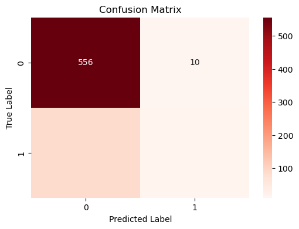
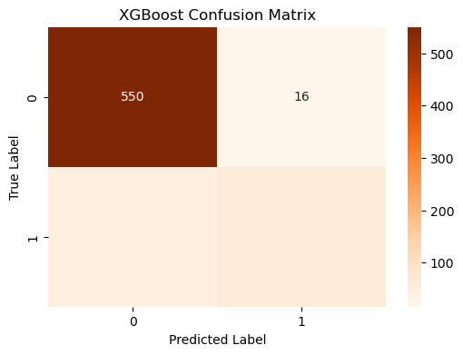
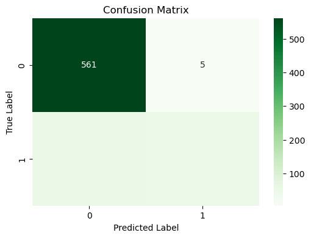
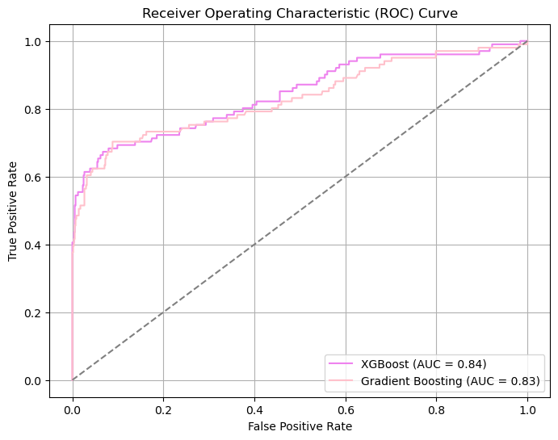

# Predictive analysis for customer churn in SyriaTel

# Overview
This project aims to address the inefficient management of customer churn within SyriaTel's subscriber base, where traditional churn prediction methods have proven suboptimal, leading to ineffective resource allocation and missed opportunities for retaining valuable customers. To solve this problem, the project leverages advanced analytics and machine learning techniques to develop a predictive model that accurately identifies customers at risk of churn.

# Business Understanding
SyriaTel, a telecommunications company, is experiencing high customer churn rates, which means customers are stopping their service and going to competitors. This leads to lost revenue and potential decline in market share. The company wants to reduce customer churn to increase their revenue and customer retention, which will be done through analysing historical customer data and using advanced analytics and predictive modelling. By predicting which customers are likely to leave, SyriaTel can take proactive measures to retain them, strengthening its position in the telecommunications industry.

The key stakeholders include:
SyriaTel Management who are interested in strategies to reduce churn.
Marketing Team which needs to target at-risk customers with retention campaigns.
Customer Support whose interest is to provide better service to customers likely to churn.

# Data Understanding
The dataset is sourced from Kaggle. It provides information on the customers behaviors which enables analysis and prediction of the churn patterns. It contains 3333 entries and 21 columns. 

Summary of the datasets features:

- State: The state where the customer resides.
- Account Length: The number of days the customer has maintained an account.
- Area Code:T he customer's area code.
- Phone Number: The customer's phone number.
- International Plan: Indicates if the customer is subscribed to the international plan or not.
- Voice Mail Plan: Indicates if the customer is subscribed to the voice mail plan or not.
- Number Vmail Messages: The count of voicemail messages sent by the customer.
- Total Day Minutes: The total number of minutes the customer spent on calls during the day.
- Total Day Calls: The total number of calls made by the customer during the day.
- Total Day Charge: The total charges incurred by the customer for daytime calls.
- Total Eve Minutes: The total number of minutes the customer spent on calls during the evening.
- Total Eve Calls: The total number of calls made by the customer during the evening.
- Total Eve Charge: The total charges incurred by the customer for evening calls.
- Total Night Minutes: The total number of minutes the customer spent on calls during the night.
- Total Night Calls: The total number of calls made by the customer during the night.
- Total Night Charge: The total charges incurred by the customer for nighttime calls.
- Total Intl Minutes: The total number of minutes the customer spent on international calls.
- Total Intl Calls: The total number of international calls made by the customer.
- Total Intl Charge: The total charges incurred by the customer for international calls.
- Customer Service Calls: The number of calls made by the customer to customer service.
- Churn: Indicates if the customer has ended their contract or not.

# Modeling
1. Baseline model: Logistic Regression: 
2. XGboost Classifier: 
3. Gradient Boosting Model: 
4. Tuning the best two models: 

# Evaluation
Three models were tested: Logistic Regression, Gradient Boosting, and XGBoost. After evaluation, two models were fine-tuned for improved performance. The Test ROC AUC Score measures the model's ability to distinguish between positive and negative outcomes.In this case, Gradient Boosting had the highest score of 0.76, indicating superior performance in differentiating between outcomes. 

Gradient Boosting outperformed the other models, demonstrating higher accuracy and a better balance between true positives and false positives. It effectively identifies customers likely to leave while minimizing false positives.

# Conclusion
Gradient Boosting outperformed the other models, demonstrating higher accuracy and a better balance between true positives and false positives. It effectively identifies customers likely to leave while minimizing false positives.
Several features such as the total day minutes, total night minutes, total eve minutes, international plan and voicemail plans are key predictors of churn. Higher call durations during the day, night and evening increase the likelihood of churn. Customers without an international plan and a voice mail plan are more likely to churn.

# Recommendation
- Introduce Loyalty Programs and Offers: Implement loyalty programs, exclusive offers, and perks to incentivize customer retention. Provide discounts, free upgrades, or access to premium content to reward long-term customers.

- Maintain Regular Communication: Keep in regular contact with customers through personalised emails, SMS, or in-app messages. Inform customers about new services, features, and promotions to keep them engaged and informed.

- Customise Customer Experience: Leverage customer data and analytics to understand individual preferences and behaviours. Tailor marketing messages, offers, and service suggestions to make each customer feel valued and improve their overall experience.

- Predict and Prevent Churn: Utilise data analytics and predictive modelling to identify potential churners. Implement targeted retention strategies to effectively reduce churn risks.

- Collect Customer Feedback: Actively seek feedback through surveys to understand customer pain points and areas for improvement. Use this feedback to enhance services and address customer needs effectively.